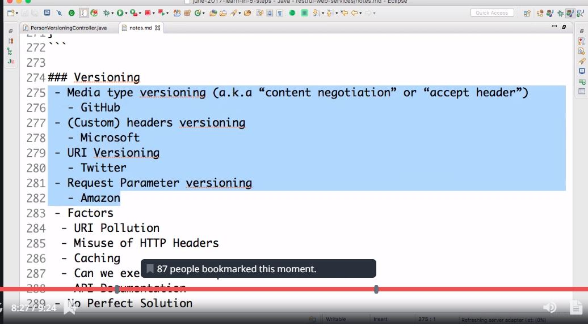

** Static Filtering **
* @JsonIgnoreProperties(value={"field1","field2",..}) at the class level
* @JsonIgnore at the field level

** Dynamic Filtering **
* Use Filter providers and MappingJacksonValue inside the controller method

** For Swagger Documentation **

``` 	
		<dependency>
			<groupId>io.springfox</groupId>
			<artifactId>springfox-swagger2</artifactId>
			<version>2.4.0</version>
		</dependency>
		
		<dependency>
			<groupId>io.springfox</groupId>
			<artifactId>springfox-swagger-ui</artifactId>
			<version>2.4.0</version>
		</dependency>
```
* Create SwaggerConfig class with annotations @Configuration @EnableSwagger2
* create api() method 


** For Spring Boot Actuator **

* # This is for enabling spring boot actuator, note there will be performance impact due to this configuration
* # management.endpoints.web.exposure.include=*

```	
		<dependency>
			<groupId>org.springframework.boot</groupId>
			<artifactId>spring-boot-starter-actuator</artifactId>
		</dependency>
		
		<dependency>
			<groupId>org.springframework.data</groupId>
			<artifactId>spring-data-rest-hal-browser</artifactId>
		</dependency>
		 
```

** Microservice Versioning **
 
